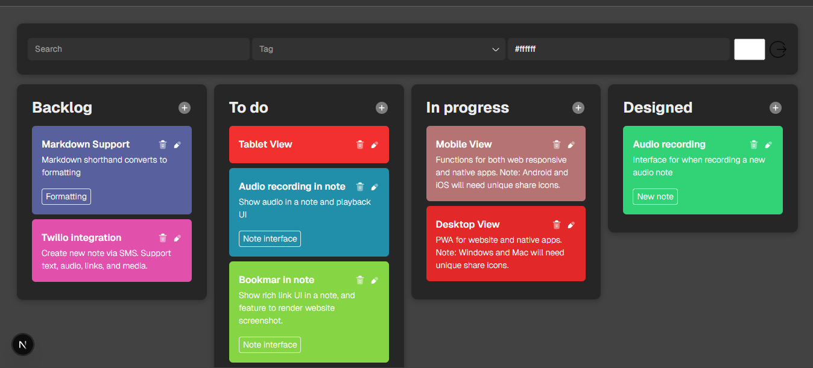

# Kanban Board

A simple Kanban Board application to manage tasks with categories and drag-and-drop functionality. Built with **React (Next.js)** for the frontend and **Node.js / Express** for the backend.

---

## Features

- Create, edit, and delete cards
- Drag and drop cards between categories
- Filter cards by search or tag
- User authentication

---

## Tools & Technologies

**Frontend:**  
- React / Next.js  
- Tailwind CSS  
- DnD Kit (for drag-and-drop)  
- Axios  

**Backend:**  
- Node.js  
- Express.js  
- MongoDB  

**Other Tools:**  
- SweetAlert2 (for alerts)  
- VS Code  
- Postman (for API testing)

---

## Installation & Setup

### Backend

1. Navigate to the backend folder:  
```bash
cd backend
```

2. Install dependencies:

```bash
npm install
```

3. Create a .env file in the backend folder with the following variables:

```bash
PORT=4000
MONGODB_URI=your_mongodb_uri
JWT_SECRET=your_jwt_secret
```

4. Run the backend server:


```bash
npm start
```

### Frontend

1. Navigate to the frontend folder:

```bash
cd frontend
```

2. Install dependencies:

```bash
npm install
```

3. Run the frontend server:

```bash
npm run dev
```

The app will run at http://localhost:3000.

## Usage

1. Register a new user or login with existing credentials.

2. Access the Kanban Board page.

3. Create new categories or cards.

4. Drag and drop cards to change categories.

5. Filter cards using search or tags.


## Sreenshot


